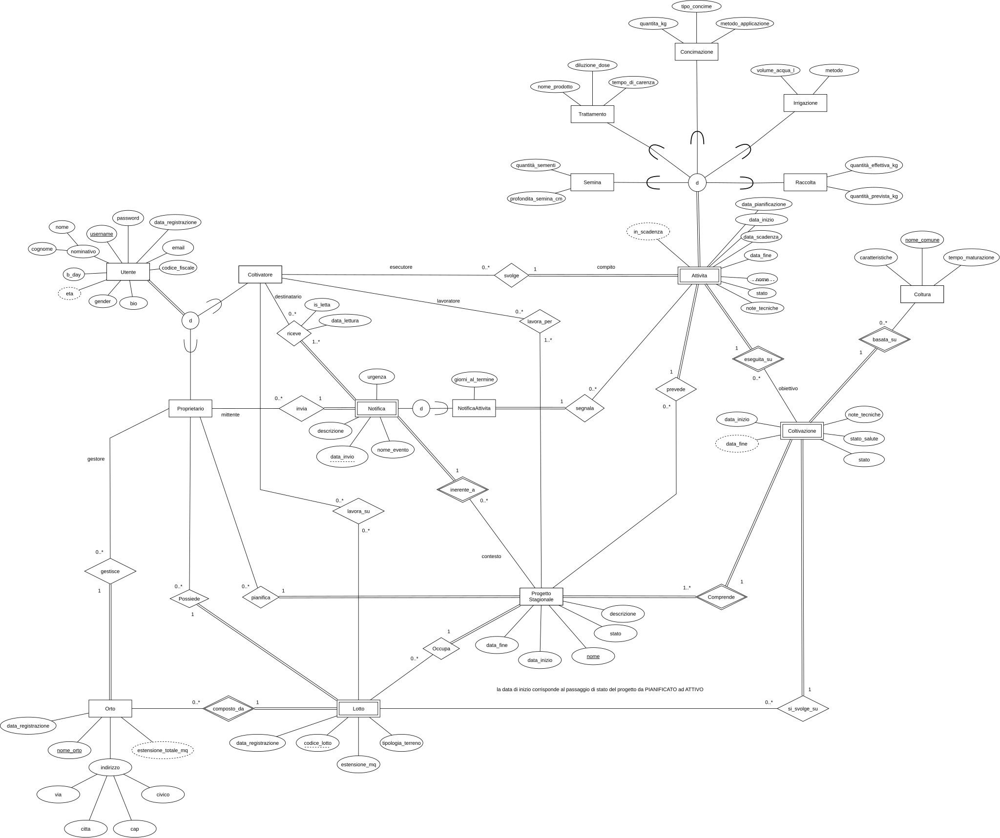
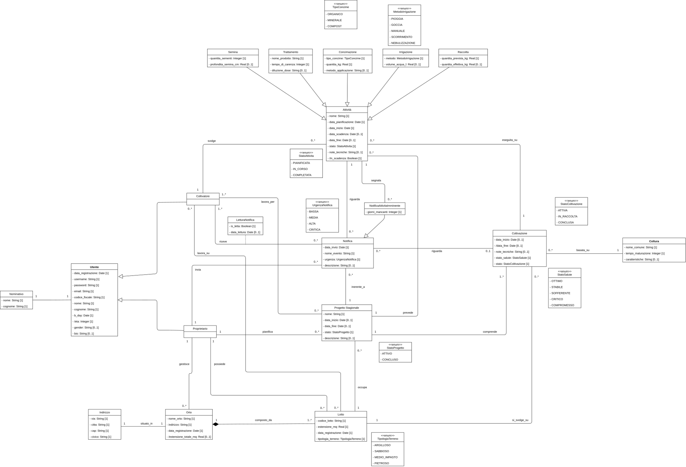
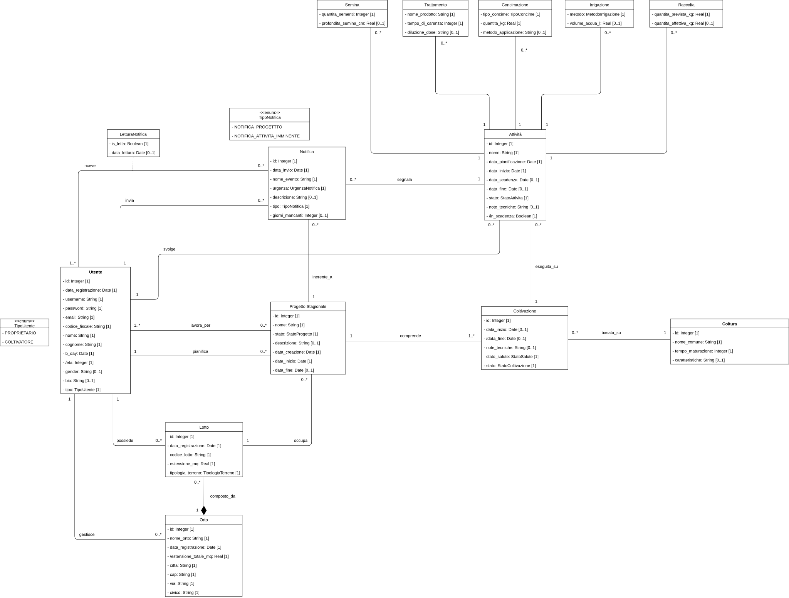
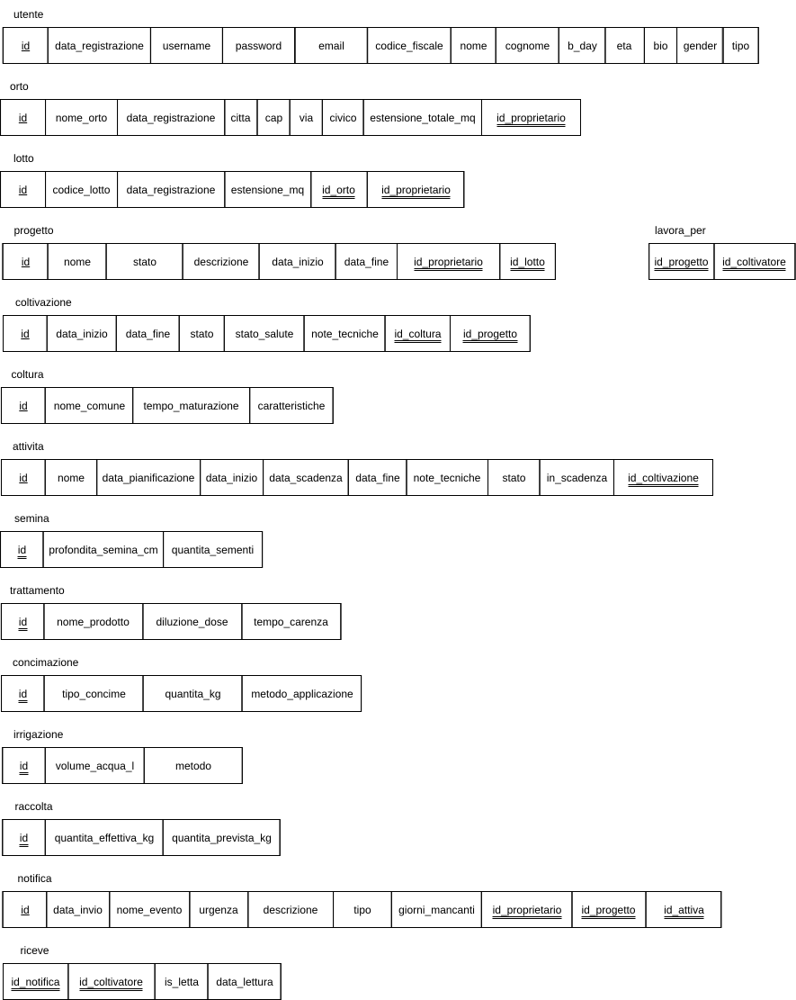

# Documentazione Progetto: Sistema Gestione Agricola

**Data:** 21 Gennaio 2026  
**Autori:** [Tuo Nome] & [Nome Collega]

---

## Analisi del Dominio

_Descrizione sintetica del contesto: gestione di orti, lotti e cicli colturali con tracciamento delle attività e sistema di notifiche._

## Modellazione Dati

todo

\newpage

### Schema Concettuale (EER)

Versione EER dello schema concettuale.

{ width=95% }

\newpage

### Schema Concettuale (UML)

Questa è la versione UML del precedente schema.

{ width=95% }

\newpage

### Schema Ristrutturato (UML)

_Descrizione delle scelte di ristrutturazione (es. accorpamento gerarchie, eliminazione attributi composti)._

{ width=95% }

\newpage

### Schema Logico

_Convenzione: Tutte le PK sono `id`, le FK seguono il formato `id_entita`._

{ width=95% }

# Dizionario dei Vincoli

## Attività

- `id_coltivatore` deve riferirsi ad un utente esistente tale che `utente.tipo = 'COLTIVATORE'` e inoltre questo coltivatore deve essere associato al progetto dell'attività tramite la relazione `lavora_per`.

| Stato Originale | Stato Destinazione | Condizione |     |
| :-------------- | :----------------- | :--------- | --- |
| **-**           | PIANIFICATA        |            |     |
| PIANIFICATA     | IN_CORSO           |            |     |
| IN_CORSO        | COMPLETATA         |            |     |
| COMPLETATA      | **-**              |            |     |

- se `stato = COMPLETATA` non è più possibile modificare l'attività che entra in modalità read only
- `data_pianificazione` non può essere modificata
- `id_coltivazione` non può essere modificato

## Coltivazione

| Stato Originale | Stato Destinazione | Condizione                                                                                                                                           |
| :-------------- | :----------------- | :--------------------------------------------------------------------------------------------------------------------------------------------------- |
| -               | ATTIVA             |                                                                                                                                                      |
| ATTIVA          | IN_RACCOLTA        | Non ci devono essere attività associate non terminate, ad eccezione dell'attività di raccolta che deve essere in corso (`raccolta.stato = IN_CORSO`) |
| IN_RACCOLTA     | CONCLUSA           | L'attività di raccolta è terminata                                                                                                                   |
| CONCLUSA        | **-**              |                                                                                                                                                      |

- se `stato = IN_RACCOLTA o CONCLUSA` allora non è più possibile pianificare attività sulla coltivazione
- se `stato = CONCLUSA` non è più possibile modificare la coltivazione che entra in modalità read only
- `data_inizio` deve essere maggiore o uguale della data di inizio del progetto associato alla coltivazione
- `id_progetto` non può essere modificato
- `id_coltura` non può essere modificato
- ad una coltivazione può essere associata solo una attività di raccolta
## Progetto

- `id_proprietario` deve riferirsi ad un utente esistente tale che `utente.tipo = PROPRIETARIO`
- la `data_fine` deve essere `NULL` finché il progetto non viene concluso
- `id_lotto` non può essere modificato
- `id_progetto` non può essere modificato

| Stato Originale | Stato Destinazione | Condizione                                                                        |
| :-------------- | :----------------- | :-------------------------------------------------------------------------------- |
| **-**           | ATTIVO             |                                                                                   |
| ATTIVO          | CONCLUSO           | se tutte le coltivazioni associate sono concluse: `coltivazione.stato = CONCLUSA` |
| CONCLUSO        | **-**              |                                                                                   |

- se un progetto è concluso
  - non è possibile creare nuove coltivazioni
  - non è possibile associare nuovi coltivatori tramite la relazione `lavora_per`
  - non si può modificare ulteriormente il progetto che entra in uno stato read only

- il lotto che il progetto occupa deve essere uno dei lotti posseduti dall'utente proprietario del progetto

## Relazione `lavora_per`

- `id_proprietario` deve riferirsi ad un utente esistente tale che `utente.tipo = PROPRIETARIO`

## Lotto

- la `data_registrazione` del lotto non può essere modificata
- le chiavi esterne `id_proprietario` e `id_orto` non possono essere modificate
- `id_proprietario` deve riferirsi ad un utente esistente tale che `utente.tipo = PROPRIETARIO`
- un lotto può essere occupato da più progetti ma da un solo progetto attivo alla volta (`progetto.stato = ATTIVO`)

## Orto

- `id_proprietario` deve riferirsi ad un utente esistente tale che `utente.tipo = PROPRIETARIO`

## Notifica

- se `tipo = NOTIFICA_PROGETTO` allora `id_attivita` deve essere `NULL`
- se `tipo = NOTIFICA_ATTIVITA_IMMINENTE` questa notifica **non** deve essere associata ad un coltivatore tramite la relazione `riceve`
- se `tipo = NOTIFICA_ATTIVITA_IMMINENTE` allora `id_attivita` deve riferirsi ad un attività del progetto

## Relazione `riceve`

- una notifica può essere inviata soltanto ai coltivatori associati al progetto della notifica tramite la relazione `lavora_per`
